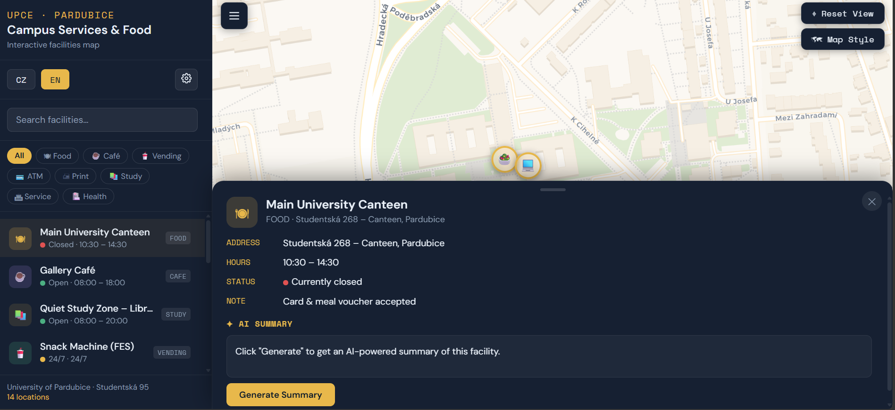

# 🗺️ UPCE Campus Map — Food & Services
Interactive map of food and service facilities at the University of Pardubice campus. Designed for students who need to quickly find where to eat, print something, withdraw cash, or access other everyday services. The app covers 14 locations across the campus on Studentská street, including the main canteen, cafés, vending machines, ATM, copy centre, library study zones, and student administration offices. It supports Czech and English and can generate short AI descriptions of any facility using the Gemini API.

Screenshot of the UPCE Campus Map web application showing the interactive University of Pardubice campus map with bilingual sidebar navigation, category filters, searchable facility list, real-time service status, and the detailed information panel for the Main University Canteen including hours, address, status, and Gemini AI summary integration.

## Deployment

`upce-map.html` is a **stand-alone file** — no server, no installation, no dependencies. Place it anywhere and open it in a browser.

| Method | Steps |
|---|---|
| **Local file** | Open `upce-map.html` directly in your browser |
| **USB / network share** | Copy the file and open it on any machine |
| **Local dev server** | `python3 -m http.server 8080` → open `http://localhost:8080/upce-map.html` |
| **GitHub Pages** | Rename to `index.html`, push to a repo, enable Pages under **Settings → Pages → Source: main / root** |
| **Netlify** | Go to [app.netlify.com/drop](https://app.netlify.com/drop), rename to `index.html`, drag and drop — instant public URL, no account required |

---

## Preview
To see the app in action, https://woma777.github.io/upce-map/
## Usage

### Moving Around

The map opens centred on the UPCE campus at zoom level 16. Use standard mouse or touch gestures to pan and zoom. The **⌖ Reset View** button (top-right) returns to the campus overview and clears any active search or filter.

### Finding a Facility

The sidebar lists all 14 facilities with live status indicators:

- 🟢 Open
- 🔴 Closed
- 🟡 24/7

Use the **search box** to filter by name or description, or use **category chips** (Food, Café, Vending, ATM, Print, Study, Service, Health) to show only one type. Both the list and map markers update as you filter.

Click any **marker on the map** or any **item in the sidebar** to open a detail panel showing the full address, opening hours, status, access notes, and AI summary section.

### Map Style

The **🗺 Map Style** button (top-right) cycles between three tile themes:

| Theme | Source |
|---|---|
| Voyager (default) | CartoDB |
| Light | CartoDB |
| Smooth | Stadia Maps |

All three are served from CDNs and require no API key. Standard OSM tiles are not used because OSM's volunteer servers require a `Referer` HTTP header that browsers don't send when opening a local file.

### Language

The **CZ / EN** buttons in the sidebar switch the display language. All facility names, descriptions, addresses, and AI prompts switch instantly.

### Gemini AI Summaries

AI-generated summaries require a free Gemini API key.

**Getting a key:**
1. Go to [aistudio.google.com/app/apikey](https://aistudio.google.com/app/apikey)
2. Sign in with a Google account
3. Click **Create API key** and copy the string starting with `AIza…`
4. The free tier allows enough requests for personal use

**Using it in the app:**
1. Click the **⚙ icon** in the sidebar
2. Paste your key and click **Save** — it's stored in your browser's local storage, so you only need to do this once per browser
3. Select any facility and click **Generate Summary**

The app sends a prompt to **Gemini 1.5 Flash** built from the facility name, description, address, and hours in the active language, and shows the response within a few seconds.

---

## Known Issues & Roadmap

### Known Issues

- **API key exposure** — The Gemini API key is sent as a URL query parameter and is visible in the browser network tab. Acceptable for personal use; a backend proxy would be needed for public deployment.
- **Split opening hours** — The opening hours parser handles one time range per facility. Locations with split hours (e.g. 09:00–12:00, 13:00–15:00) are evaluated on the first range only.
- **POI coordinates** — Coordinates were verified using OpenStreetMap building outlines but not GPS-surveyed on the ground; minor positional differences of a few metres are possible.

### Planned

- Walking-route overlay from the user's current position to the selected facility using Leaflet Routing Machine
- Natural-language query mode ("Where can I print near FES?") using the existing Gemini integration
